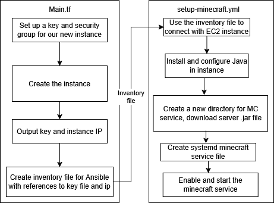

# Automated AWS Minecraft Server

*Created by Andrew Hays ([haysan@oregonstate.edu](mailto:haysan@oregonstate.edu))*

## Background

- This repo contains scripts you can run to create an AWS Minecraft server without ever visiting the AWS Management Console.
- The server will be run within an AWS **EC2** instance.
  - AWS EC2 instances are virtual computers in the cloud that you can rent to run applications such as our Minecraft server.
- I have automated the process of creating an instance and starting the Minecraft server via two files in this repo:
  1. **main.tf**
     - This is a Terraform configuration file that sets up our EC2 instance
       - Creates a key we can use to connect with the instance
       - Outputs the public IP address of the instance. 
     - Terraform is a Infrastructure as Code (IaC) tool
       - IaC tools like Terraform allow us to define and provision infrastucture such as EC2 instances with code files rather than doing it manually.
  2. **setup-minecraft.yml**
     - After we have created the EC2 instance using **main.tf,** this file sets up the Minecraft server inside of our instance.
     - This file is an Ansible Playbook.
       - Ansible is an open-source automation tool that allows us to automate tasks such as setting up the server.
       - Ansible Playbooks define a sequence of instructions to be executed.
     - This file downloads the necessary resources to set up the server in our EC2 instance.
     - After installing resources, it starts the Minecraft server running on Port **25565** in our instance.
     - This playbook also configures the Minecraft server to restart if it goes down for any reason.
     - I am using a Windows machine (Ansible needs Linux) so we will be using WSL to run this Playbook.
       - WSL allows us to create a Linux environment on our Windows machine  

To Proceed, first install all dependencies listed in **Requirements,** and then you can follow the instructions in **Commands** to set up the server.

## Requirements

- **Windows Powershell**
  - This tutorial assumes you are using a Windows machine.
  - I used Powershell version **5.1.19041.5848**
  
- **Terraform**
  - Follow [this installation guide](https://developer.hashicorp.com/terraform/tutorials/aws-get-started/install-cli)
  - This should be installed on your Windows machine
  - I used Terraform version **1.12.1**

- **AWS CLI**
  - Follow [this installation guide](https://developer.hashicorp.com/terraform/tutorials/aws-get-started/install-cli)
  - This should be installed on your Windows machine
  - I used version **2.27.31**

- **AWS learner lab credentials**
  - From the learner lab page:
    - Start the lab
    - Click "AWS Details" 
      - In the Details pane, you should see a block of text formatted as such:
        ```
        [default]
        aws_access_key_id=
        aws_secret_access_key=
        aws_session_token=
        ```
      -  Create a new file ```~/.aws/credentials``` and copy in this text
      -  **NOTE:** for this tutorial to work, your AWS region should be **us-east-1**
 
- **Git**
  - You will need git to clone this repo
  - I used version **2.38.1.windows.1**

- **WSL**
  - You will need WSL to use Ansible
  - [Follow this tutorial](https://learn.microsoft.com/en-us/windows/wsl/install) to install WSL
  - I used version **2.5.7.0**

- **Ansible**
  - Follow [this installation guide](https://docs.ansible.com/ansible/latest/installation_guide/installation_distros.html#installing-ansible-on-ubuntu)
  - This should be installed through your WSL terminal.
  - I used version **2.16.5** with Python version **3.12.3**

- **Minecraft Java Edition**
  - You will need to purchase and download the latest [Minecraft Java Edition](https://www.minecraft.net/en-us/store/minecraft-java-bedrock-edition-pc?tabs=%7B%22details%22%3A0%7D) version if you want to play.
  - This is **NOT** required for the server setup!

## Pipeline Overview




## Commands

### Part 1: Powershell

- First open a Powershell instance as administrator

- Clone this REPO and switch to the newly created directory:
  - ```git clone https://github.com/andrew1017/CS312_CP2.git```
  - ```cd CS312_CP2```
  
- Use Terraform commands to create AWS resources from **main.tf,** answering "yes" to any prompts:
  1. ```terraform init```
  2. ```terraform apply```
  3. ```terraform output -raw private_key_pem > minecraft-key.pem```
     - This creates a key file called "minecraft-key.pem"

### Part 2: WSL

- Open a WSL terminal
- Access your local directory for the project via the ```mnt``` folder in WSL:
  - Example command: ```cd /mnt/c/Users/chris/Documents/CS312_CP2```
- We need to create a copy of the minecraft key file in our WSL home directory.
  1. Create the new file in WSL Home with: ```nano ~/.minecraft-key.pem```
  2. Manually copy and paste the contents of the original minecraft-key.pem file from your Windows machine into this new version we made in WSL home.
     - I recommend simply opening the original file with Notepad, selecting all the text and copying it into the new version opened in WSL.
     - We need to do this because the Windows file formatting will not work with Ansible in WSL.
     - The Ansible Playbook will be run with an inventory file that was generated by main.tf
       - This inventory playbook contains a reference to ```~/.minecraft-key.pem``` 
  3. Set permissions for the WSL copy of our key with ```chmod 600 ~/.minecraft-key.pem```
- Finally, we use Ansible to set up and start the server in our instance with:
  - ```ansible-playbook -i inventory setup-minecraft.yml```

## Connecting to the Minecraft Server

#### Testing connection without Minecraft

- Earlier, we ran the ```terraform apply``` command.
- At the bottom of the command output, you should see something like:
    ```
    Outputs:
    instance_ip = "54.157.52.222"
    ```
- Copy your ```instance_ip``` value from the ```terrafrom apply``` output.
- In your Powershell terminal, run the command:
  - ```nmap -sV -Pn -p T:25565 <ip>```
    - Replace ```<ip>``` with your ```instance_ip``` value.
- You should see a message containing something similar to:
```
PORT      STATE SERVICE   VERSION
25565/tcp open  minecraft Minecraft 1.21.5 (Protocol: 127, Message: A Minecraft Server, Users: 0/20)
```
- ```open``` under ```STATE``` indicates a successful connection.

#### Testing connection with Minecraft
- **NOTE**: I have not purchased Minecraft Java Edition so steps may not be fully accurate
1. Launch Minecraft Java Edition on your Windows machine
2. Select **Multiplayer**
3. Select **Add a Server** option
4. Enter the ```instance_ip``` value from ```terraform apply``` for the server IP
5. You should now be able to click **Done** and then **Join Server** to connect.
  

    
 

